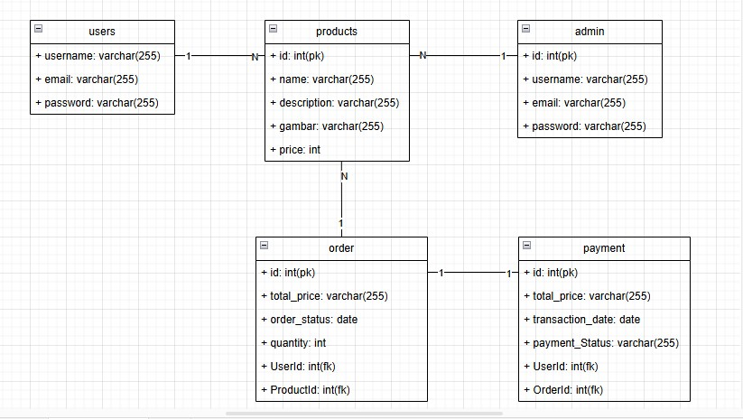
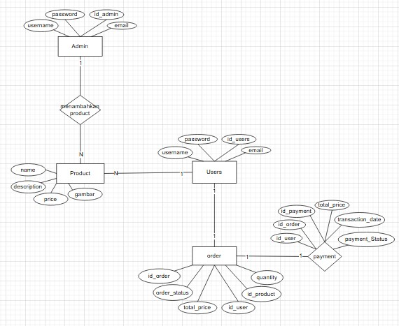
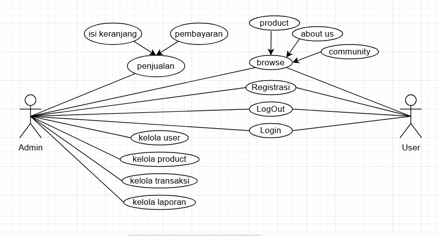

# SISTEM BACKEND E-COMMERCE RESTFULL API

## SERVER BERJALAN DI http://localhost:5500/

## DESKRIPSI PROJECT
Project ini dibuat dengan Express JS sebagai framework dan sequelize dalam pemilihan orm di Node.js. API ini memungkinkan pengguna untuk melakukan operasi CRUD (Create, Read, Update, Delete) pada user, admin, order(cart), transaksi, dan product.

## TEKNOLOGI YANG DIGUNAKAN
- `express`
- `mysql2`
- `sequelize`
- `dotenv`
- `cors`
- `bcrypt`
- `jsonwebtoken`
- `cookie-parser`
- `nodemon`
- `body-parser`
- `bcrypt`
- `bcryptjs`

## CARA PENGGUNAAN
1. Pastikan Node.js dan npm telah terinstall di komputer Anda.

2. Clone atau download projek ini ke direktori lokal Anda.

3. Jalankan npm install untuk menginstall dependensi yang diperlukan.

4. Buat file env dan beri variabel PORT dan DB_NAME (sesuai nama database).

5. Jalankan node models/index.js untuk membuat Table.

6. Untuk melakukan testing wajib Menjalankan node seeders/seeders.js untuk menambah nilai default admin Pemilik.

7. Jika table database sudah dibuat jalankan aplikasi dengan command node npm run dev / nodemon index.js.

8. Aplikasi akan berjalan di http://localhost:PORT, dengan PORT adalah nomor port yang ditentukan dalam file .env.

## RELASI

- **Product dan Order** memiliki hubungan **one-to-many (1:N)**, di mana satu **Product** hanya bisa memiliki satu **Order**.  
  - Jika **Product** dihapus, **Order** yang terkait juga ikut terhapus (**CASCADE**).  
  - Jika **Product** diperbarui, perubahan akan berdampak pada **Order** terkait.  
  - **Order** menyimpan **ProductId** sebagai foreign key untuk menunjukkan produk yang dipesan.

- **Users dan Transaksi** memiliki hubungan **one-to-one (1:1)**, di mana satu **Users** hanya bisa memiliki satu **Transaksi**.  
  - Jika **Users** dihapus, **Transaksi** yang terkait juga ikut terhapus (**CASCADE**).  
  - Jika **Users** diperbarui, perubahan akan berdampak pada **Transaksi** terkait.  
  - **Transaksi** menyimpan **UserId** sebagai foreign key untuk menunjukkan pengguna yang melakukan transaksi.

- **Order dan Transaksi** memiliki hubungan **one-to-one (1:1)**, di mana satu **Order** hanya bisa memiliki satu **Transaksi**.  
  - Jika **Order** dihapus, **Transaksi** yang terkait juga ikut terhapus (**CASCADE**).  
  - Jika **Order** diperbarui, perubahan akan berdampak pada **Transaksi** terkait.  
  - **Transaksi** menyimpan **OrderId** sebagai foreign key untuk menunjukkan order yang diproses dalam transaksi.

- **Users dan Order** memiliki hubungan **one-to-one (1:1)**, di mana satu **Users** hanya bisa memiliki satu **Order**.  
  - Jika **Users** dihapus, **Order** yang terkait juga ikut terhapus (**CASCADE**).  
  - Jika **Users** diperbarui, perubahan akan berdampak pada **Order** terkait.  
  - **Order** menyimpan **UserId** sebagai foreign key untuk menunjukkan pengguna yang melakukan pemesanan.

## ROUTER
`users/admin/order/products/transaksi`
- get ( /users/ )
- getById (/users/find/1)
- post (/users/create)
- put (/users/update)
- delete (/users/delete)

## STRUKTUR FOLDER
### <b>BackEnd</b>
- controller (untuk Membuat fungsi tiap tabel)
- message ( template yang digunakan untuk response hasil )
- middleware ( membuat function verifikasi token )
- models ( membuat setiap tabel )
- img ( menyimpan gambar yang diinput )
- router ( Membuat logic router setiap tabel )
- utils ( menghubungkan server ke database )
- index.js ( file untuk route inti )

## UML

### Class Diagram

### ERD

### UseCase
