# E-COMMERCE
Pada project yang saya buat bertemakan E-COMMERCE, di project ini saya menggunakan Library React Vite, Tailwind CSS, React Router Dom, React Icon, Axios, dan Jsonwebtoken.

## DEKRIPSI PROJECT
<b>E-Commerce Clothing Brand</b> adalah platform belanja online untuk berbagai produk fashion. Platform ini memungkinkan pengguna untuk menjelajahi katalog produk, melihat detail produk, menambahkan ke keranjang, melakukan checkout, dan lokasi store berada.

## FITUR UTAMA
- Authentication & Authorization – Registrasi, login, dan manajemen sesi menggunakan JSON Web Token (JWT).

- Product Catalog – Menampilkan daftar produk dengan kategori, harga, dan deskripsi.

- Shopping Cart – Pengguna dapat menambahkan produk ke keranjang dan mengubah jumlah pesanan.

- Checkout & Payment – Sistem checkout dengan simulasi pembayaran.

- Map – Penggunaan untuk mencari lokasi store berada.

- Admin Dashboard – Manajemen produk, kategori, dan pesanan oleh admin.

## TEKNOLOGI YANG DIGUNAKAN
- Frontend: React (Vite), Tailwind CSS, React Router DOM, React Icons

- Backend: Express.js, Node.js, Sequelize

- Database: MySQL

- Authentication: JSON Web Token (JWT)

- API Communication: Axios

## LINK HALAMAN
Tampilan halaman ini digunakan untuk melakukan Register, berikut link untuk mengakses : http://localhost:5173/regist (User) & http://localhost:5173/register (Admin)
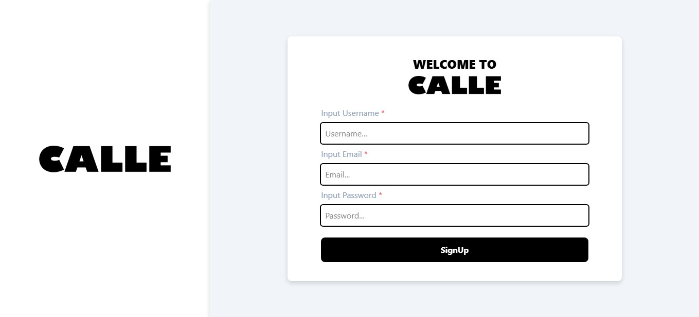

Tampilan halaman ini digunakan untuk melakukan Login, berikut link untuk mengakses : http://localhost:5173/ (User) & http://localhost:5173/login (Admin)
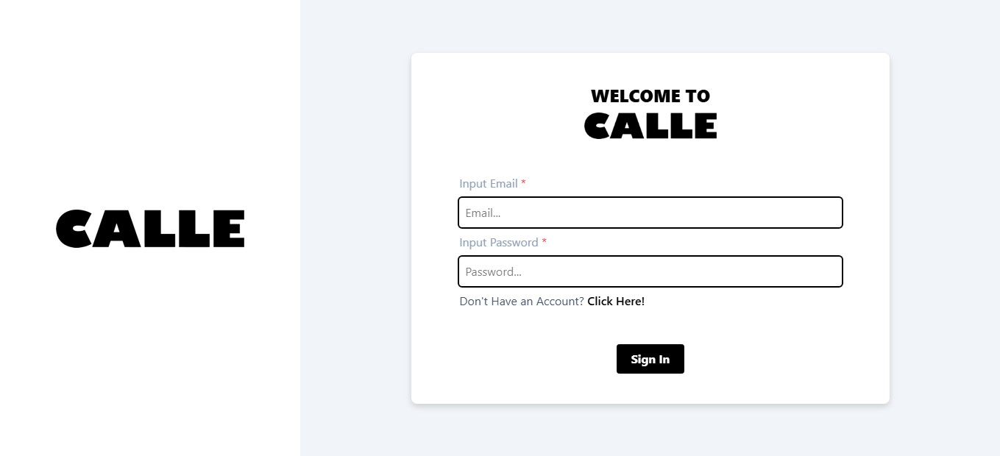

Tampilan halaman ini merupakan Landing Page awal, berikut link untuk mengakses : http://localhost:5173/home
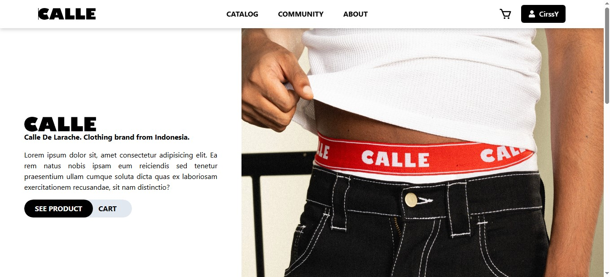

Tampilan halaman ini merupakan Landing Page product, berikut link untuk mengakses : http://localhost:5173/home
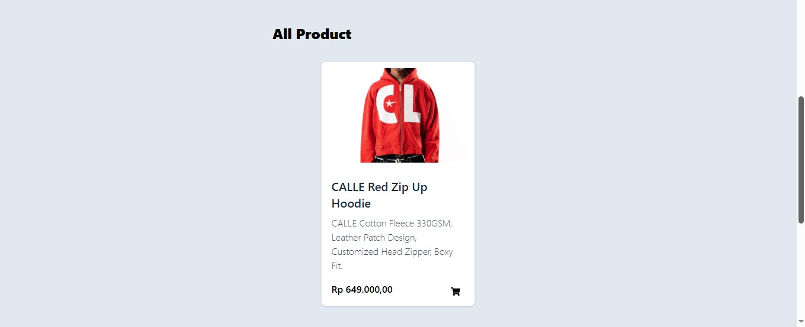

Tampilan halaman ini untuk melakukan Order product ke dalam cart, berikut link untuk mengakses : http://localhost:5173/home

Tampilan halaman ini merupakan Footer, berikut link untuk mengakses : http://localhost:5173/home
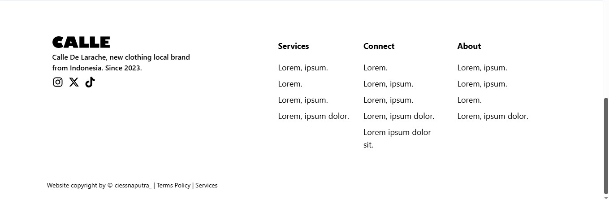

Tampilan halaman ini merupakan page dari Community, berikut link untuk mengakses : http://localhost:5173/community
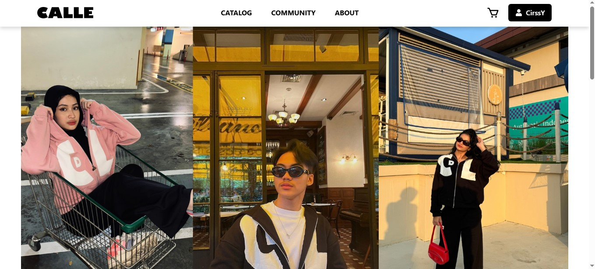

Tampilan halaman ini merupakan page dari About untuk melihat lokasi store, berikut link untuk mengakses : http://localhost:5173/about
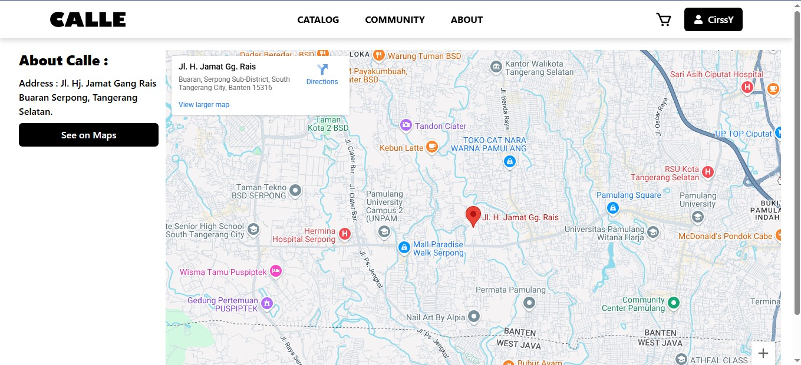

### HALAMAN DASHBOARD (HANYA ADMIN)
Tampilan halaman ini merupakan page dashboard untuk mengelola data admin, berikut link untuk mengakses : http://localhost:5173/dashboard

Tampilan halaman ini merupakan page dashboard untuk melakukan pengeditan data Admin, berikut link untuk mengakses : http://localhost:5173/dashboard
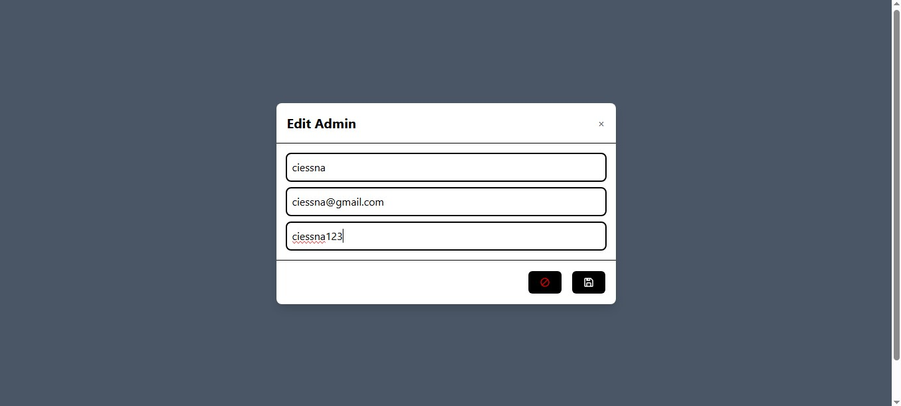

Tampilan halaman ini merupakan page dashboard untuk mengelola data users, berikut link untuk mengakses : http://localhost:5173/users
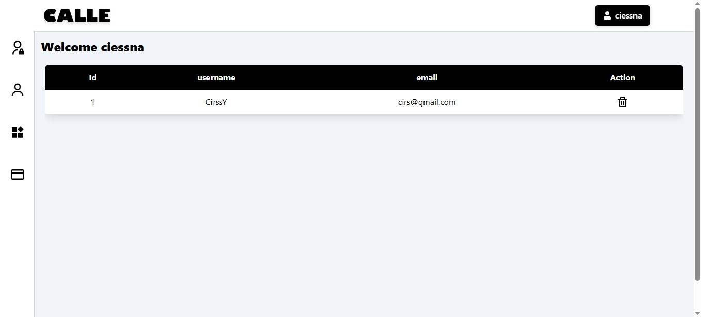

Tampilan halaman ini merupakan page dashboard untuk mengelola data product, berikut link untuk mengakses : http://localhost:5173/product
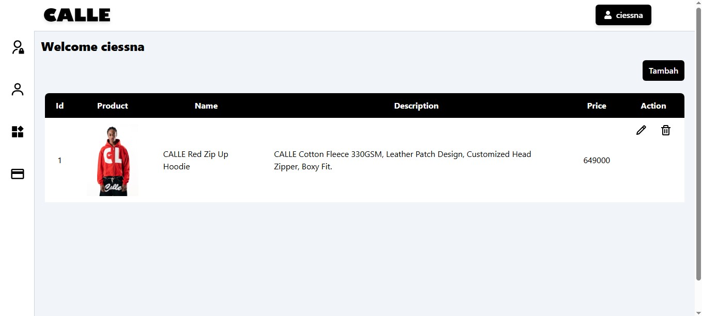

Tampilan halaman ini merupakan page dashboard untuk mengelola laporan hasil transaksi, berikut link untuk mengakses : http://localhost:5173/history
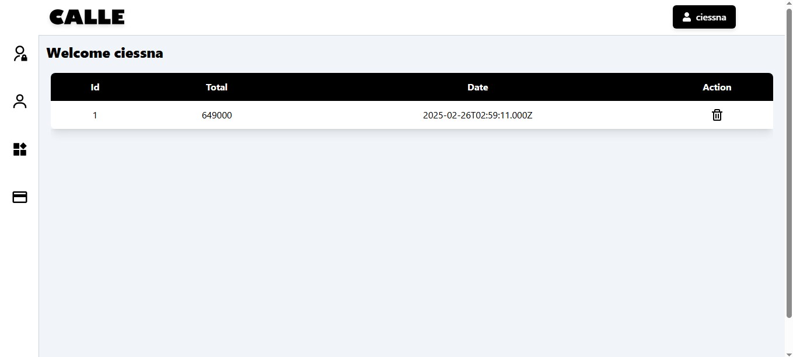